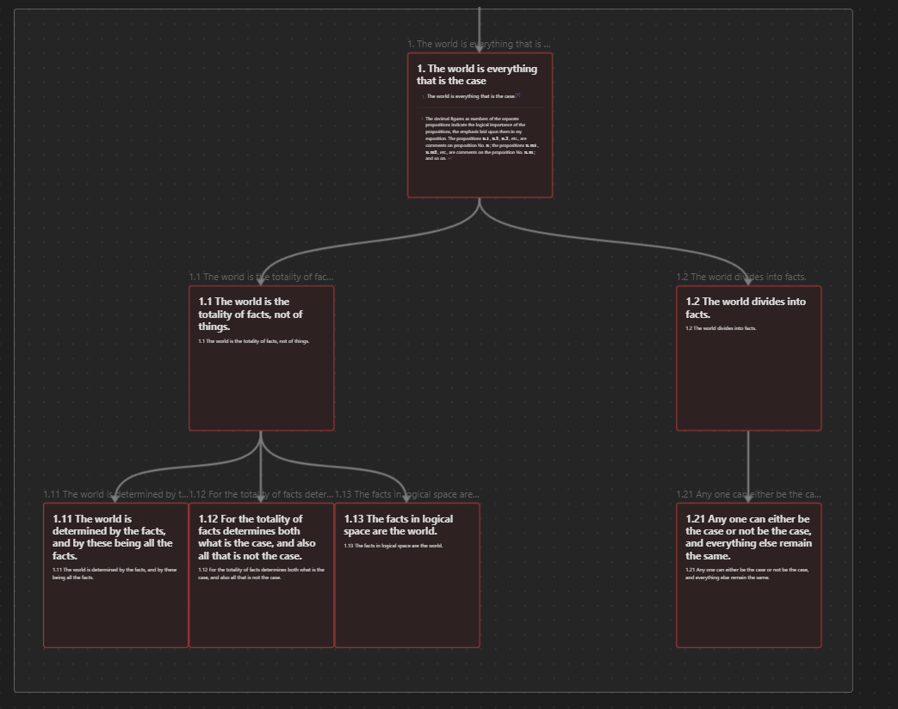

# Tractatus-Markdowno-Obsidianicus  
  
 

This is a modified Markdown version of Wittgenstein's Tractatus Logico-Philosophicus, with tags and relations between propositions, allowing a coherent Graph View on Obsidian. I also made Canvas, which allows to organize notes visually (see pictures above.)

## Overview  
  
  
  
Obsidian's Graph view is very useful to find propositions, it also has a research function !  
  
You can research tags in Obsidian so it shows you the connections between children-propositions with the same theme accross different parent-propositions.  

## Requirements  
Download and install Obsidian from the [official website](https://obsidian.md).  
Please use 7zip or Winrar to unzip the folder if it doesn't work with Windows 10.

## Prepare  
- Clone this repository, or download it as a zip and unzip it  
- Open the folder as a Vault in Obsidian
- Navigate freely through the book.

## Update  
- Canvas including all propositions
- Canvas for each proposition with their childs
- Ontology with Breadcrumbs plugin, which allows relations such as : parent, child, etc.
- tags are now hidden, you can access them through the right column or in edit mode
- Internal links are also hidden, as it is redundant with Breadcrumbs 

This project was made possible thanks to the tractatus logico-markdownicus (I laughed at the title when I discovered it, it also inspired my own title !)  
I used the Markdownicus and adapted it for Obsidian.md, therefore, here is the Obsidianicus !  
I put had to break each proposition into markdown notes, plus I added hashtags, so you can have a thematic graph view on Obsidian :)  

## Note  
I made this Tractatus Logico-Obsidianicus alone, based on the "Tractatus Markdownicus" (see bellow).  
The idea behind this project was to test my skills with Obsidian on a philosophical book.
I thought Wittgenstein's Thesis was particularly Obsidian-friendly because of its structure. I used the plugin [Breadcrumbs](https://github.com/SkepticMystic/breadcrumbs) to make an ontology. So it is now possible to view parents notes, child notes, etc.
There are other projects like mine on the internet, but they lack tags, which is why my project is singular. 

The main issue during this project was to transform Hashtags from the Markdownicus source into Obsidian Notes.  
I solved it with the plugin [Note Refactor](https://github.com/lynchjames/note-refactor-obsidian). It really helped me and saved a lot of time.  
In the future, I would like to automatize the tagging process, as it takes too much time to make alone.  
A big problem with the method I used is that it totally depends on me.  

## Opinion  
Even though this project may popularize Wittgenstein's philosophy, I disagree with the Tractatus on many points.  
If you want to go deeper0 please read other works from Wittgenstein and also, see:  
- Paul Horwich's [Wittgenstein’s Metaphilosophy](https://oxford.universitypressscholarship.com/view/10.1093/acprof:oso/9780199588879.001.0001/acprof-9780199588879).  
- John Dewey's philosophy, pragmatism and naturalism 
- Dual Inheritence Theory in Cultural Evolution  
- Free Energy Principle and Enactive Inference  

## Contributing  
I manually made tags, so if you have a suggestion to automate the process with Natural Language Processing, I take it !  
If you have any suggestion in order to sort out tags or if you think I missed something, [start an issue](https://github.com/Onto-Log/Tractatus-Markdowno-Obsidianicus/issues/new/choose) or send me a message !  

## Here are other projects based on the Tractatus  
- https://github.com/shushcat/tractatus-logico-markdownicus/  
Tractatus in Markdown, which I took as a basis for this project  

- http://tractatus.lib.uiowa.edu/map/  
Tractatus as a Train map  

- https://www.xmind.net/m/vA2p/  
Tractatus as a MindMap  

- https://pbellon.github.io/tractatus-tree/#/  
another MindMap  

- https://dstrohmaier.com/A-Different-Map-of-the-Tractatus/  
Tractatus as a vectors-representation of meaning  

## Here are some cool projects that link philosophy and "digital humanities"  
- https://ethics.spinoza.ca/  
Spinoza but better  

- http://stereotropes.bocoup.com/  
TvTropes & Feminism  

- http://modesofexistence.org/  
Bruno Latour made a book that could totally be on Obsidian because of how it is structured, so if you are determined and if you like his work... good luck !

- https://valentinlageard.github.io/  
Philpapers Graph view Taxonomy  

